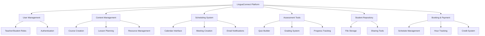
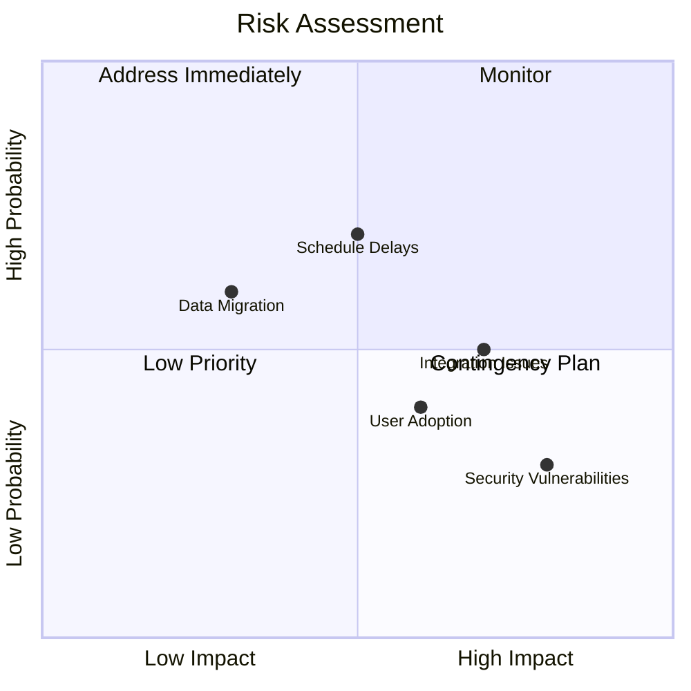
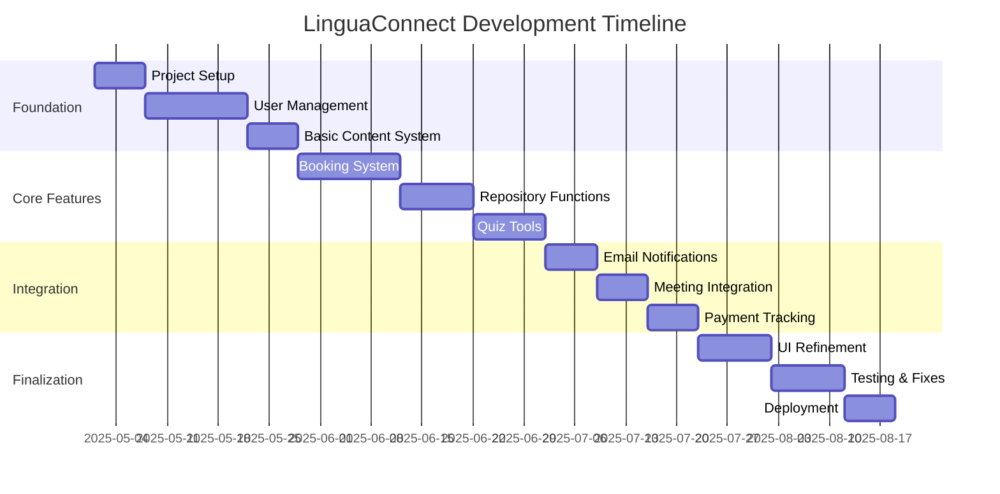
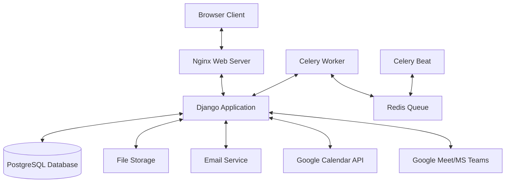
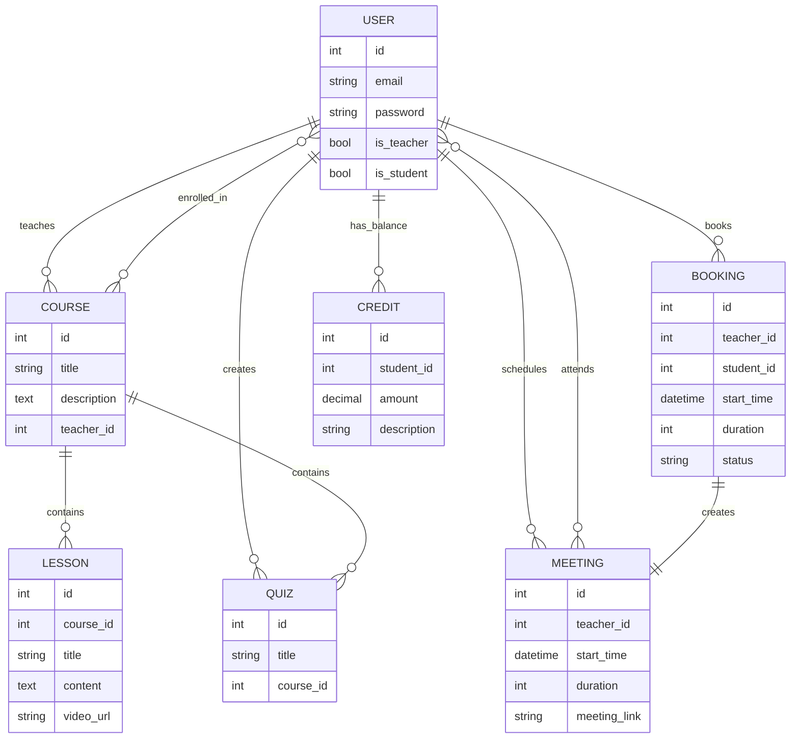
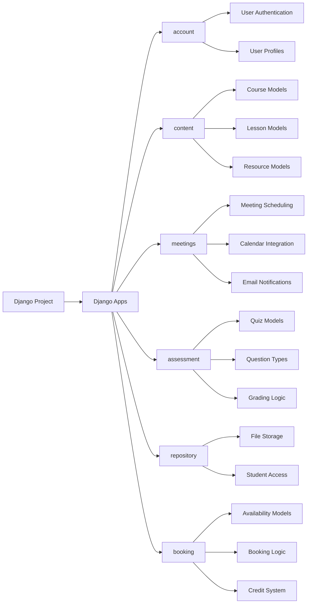
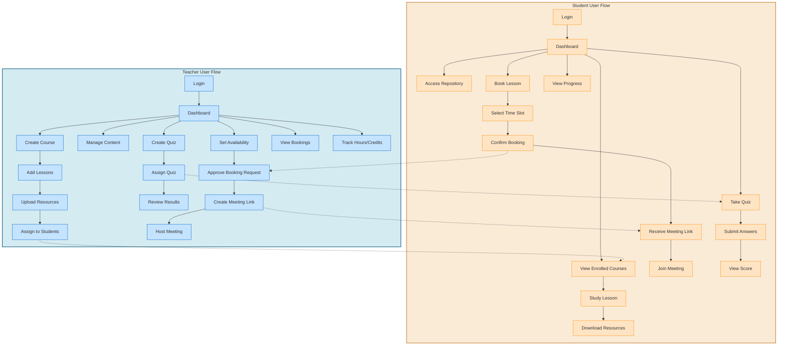
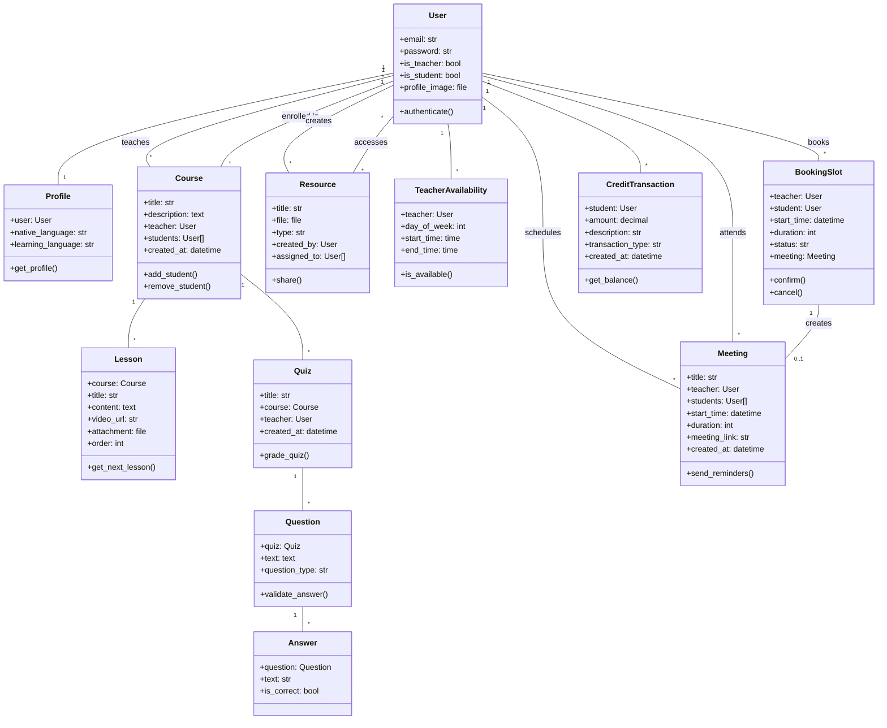

# LinguaConnect: Language School Management System
## Simplified Project Overview

---

## For Executives (C-Suite)

### Project Purpose
LinguaConnect is a comprehensive solution for language teachers to manage students, content, and scheduling in one platform. It will replace multiple disconnected tools with a single integrated system.

### Key Benefits
- **Reduced Administrative Time:** Automates scheduling, reminders, and resource management
- **Enhanced Student Experience:** Provides organized access to lessons, resources, and progress tracking
- **Improved Teaching Efficiency:** Centralizes content management and assessment tools
- **Scalability:** Built to handle growth beyond the current 6 students

### Investment Overview
- **Timeline:** 14 weeks from initiation to deployment
- **Resource Requirements:** Django/Python developer, frontend developer, project manager
- **Maintenance:** Minimal ongoing costs (hosting, occasional updates)

### ROI Highlights
- 60-70% reduction in administrative overhead
- Improved student retention through better resource access
- Enhanced teaching capacity through efficient scheduling

---

## For Project Managers

### Project Scope

### Core Requirements
1. **Content Management System**
   - Create and organize courses, lessons, and resources
   - Upload videos and multimedia content
   - Share materials with specific students
   - Lesson tagging and keyword generation afterwards

2. **Live Session Management**
   - Schedule one-on-one or group sessions
   - Generate Google Meet/Teams links automatically
   - Send email reminders 1 hour before sessions
   - Session notes/homework trackign linked to each meeting

3. **Assessment Tools**
   - Create custom quizzes with various question types
   - Track student completion and progress
   - Provide feedback on assessments

4. **Student Repositories**
   - Maintain personal file storage for each student
   - Organize resources by course/topic
   - Track access and engagement

5. **Booking and Payment Tracking**
   - Manage teacher availability
   - Track teaching hours and credits
   - Manual credit management system

### Risk Assessment

### Project Timeline

## For Technical Teams

### Technology Stack
- **Backend:** Django 4.x, Python 3.9+
- **Frontend:** Django Templates, CSS, JavaScript
- **Database:** PostgreSQL
- **Hosting:** Cloud VPS (AWS/DigitalOcean/etc.)
- **External Services:** Google Calendar API, Email Service

### System Architecture

### Key Data Models

### Core Implementation Components

### Development Approach
1. **Model-First Development**
   - Define core Django models
   - Create database migrations
   - Implement model relationships and logic

2. **View Implementation**
   - Teacher dashboard and management views
   - Student portal and resource access
   - Booking and scheduling interfaces
   - Assessment creation and taking

3. **Integration Points**
   - Google Meet/Teams link generation
   - Email notification system
   - File storage and management

4. **Testing Focus Areas**
   - User role permissions
   - Scheduling and booking logic
   - File access security
   - Email delivery reliability

---

## Implementation Checklist

### Phase 1: Foundation
- [ ] Project setup and configuration
- [ ] User authentication system
- [ ] Basic models and database schema
- [ ] Admin interface customization

### Phase 2: Core Features
- [ ] Content management system
- [ ] Resource repository functionality
- [ ] Scheduling and booking system
- [ ] Quiz and assessment tools

### Phase 3: Integration
- [ ] Calendar API integration
- [ ] Meeting link generation
- [ ] Email notification system
- [ ] File storage implementation

### Phase 4: Refinement
- [ ] UI/UX improvements
- [ ] Responsive design implementation
- [ ] Testing and bug fixes
- [ ] Performance optimization

### Phase 5: Deployment
- [ ] Production environment setup
- [ ] Data migration planning
- [ ] User training materials
- [ ] Launch and monitoring

### Flowchart

### Data graph

